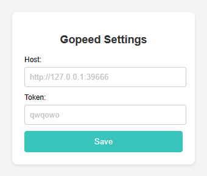
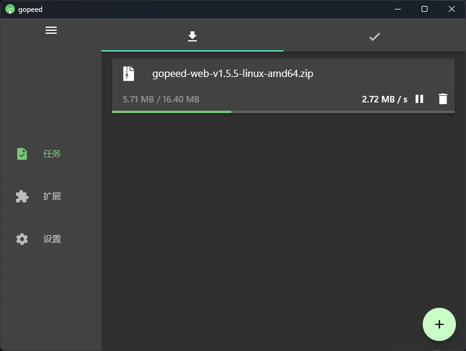

#  Gopeed-Firefox-Extension

[Gopeed](https://gopeed.com/zh-CN) 的 Firefox 系浏览器插件, [Gopeed-Chrome-Extension](https://github.com/krau/Gopeed-Chrome-Extension) 的 Firefox 简单移植版本.

## 安装与使用

在 Releases 页面下载最新的 `Gopeed-Firefox-Extension.zip` 文件.

在 Firefox 打开 about:debugging, 点击 "临时加载附加组件", 选择刚才 Gopeed-Firefox-Extension.zip.

安装后, 要[开启 Gopeed 的 API](https://docs.gopeed.com/zh/dev-api.html) , 并在插件设置中正确填写你设置的地址 (Host) 和令牌 (Token).

注意 Host 要带上协议头, 如 `http://` 或 `https://`.
